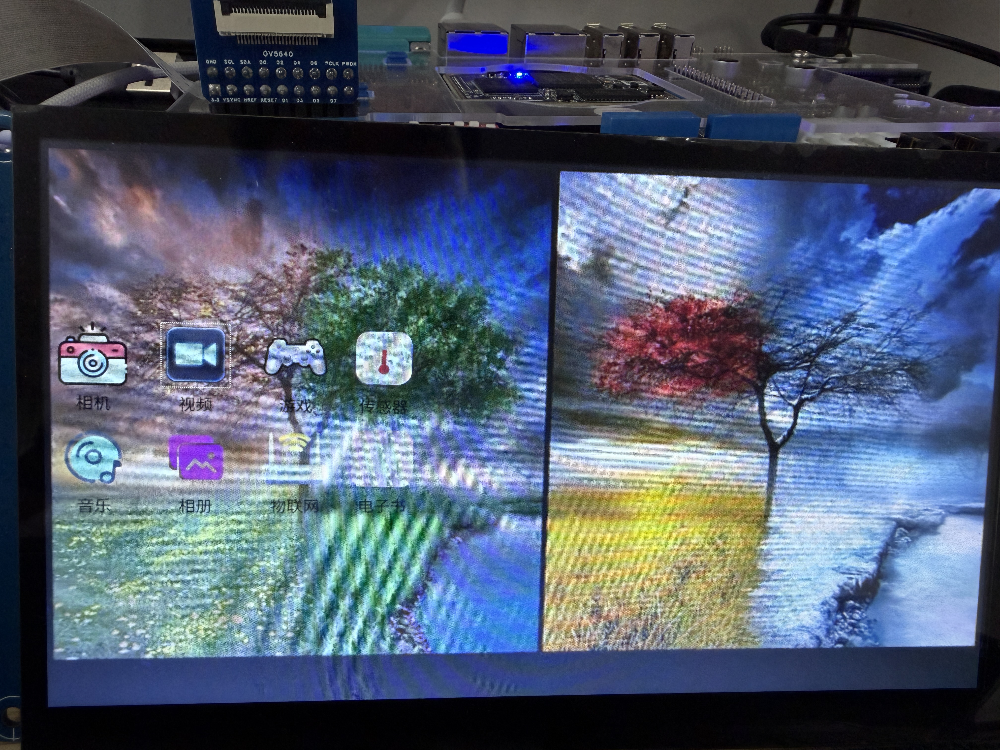
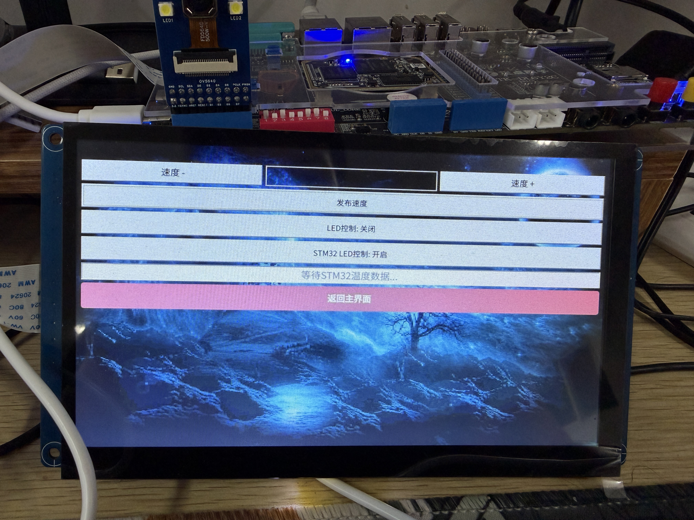
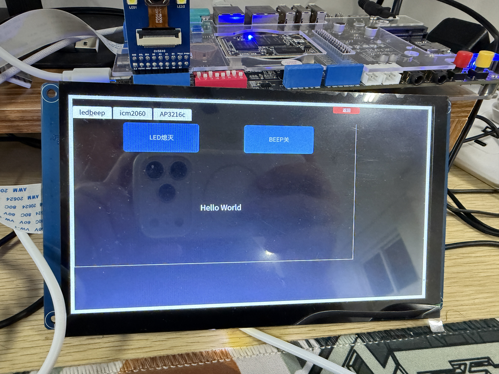
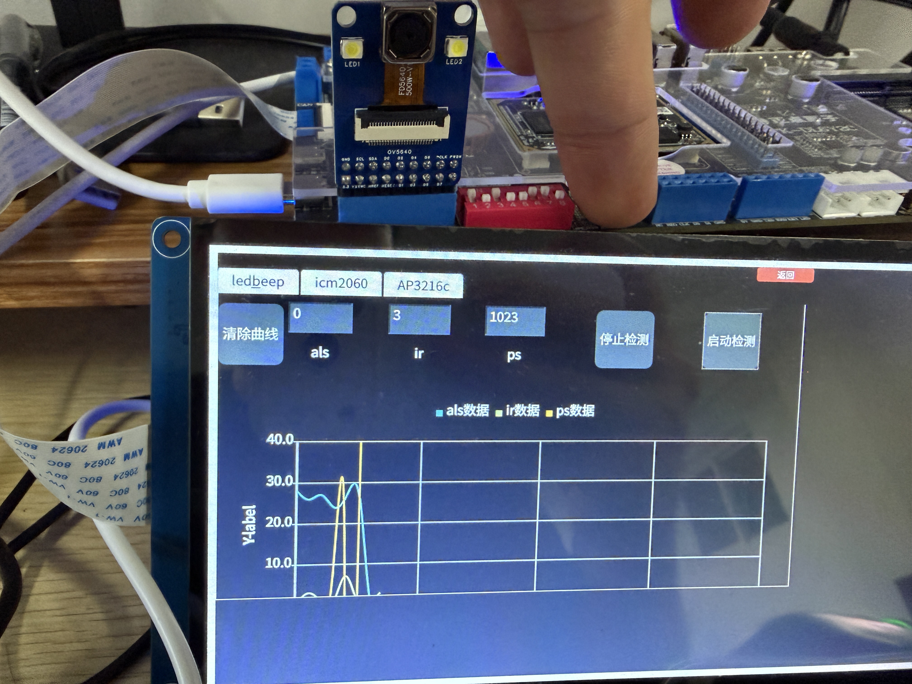
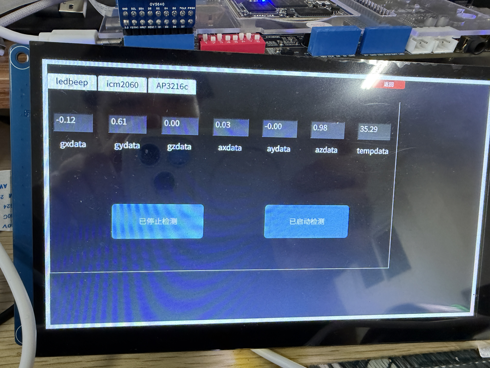
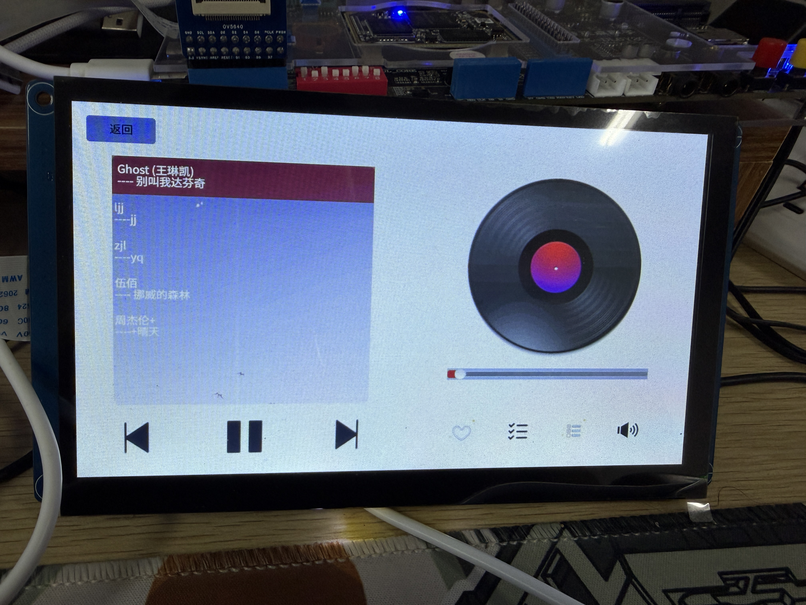
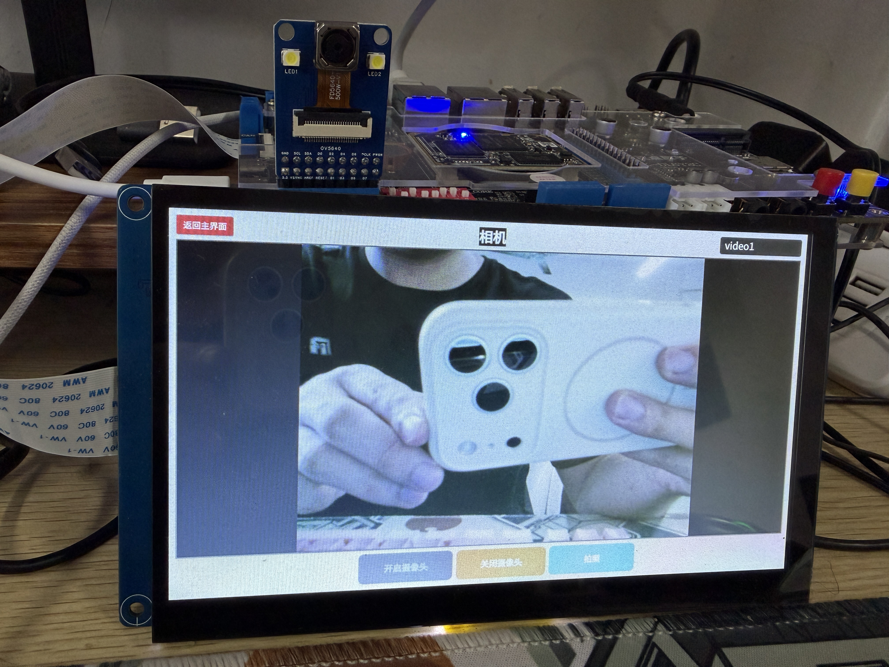
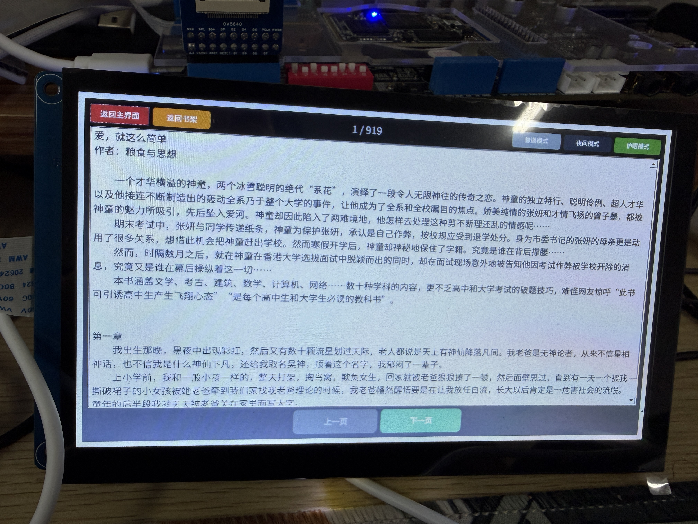
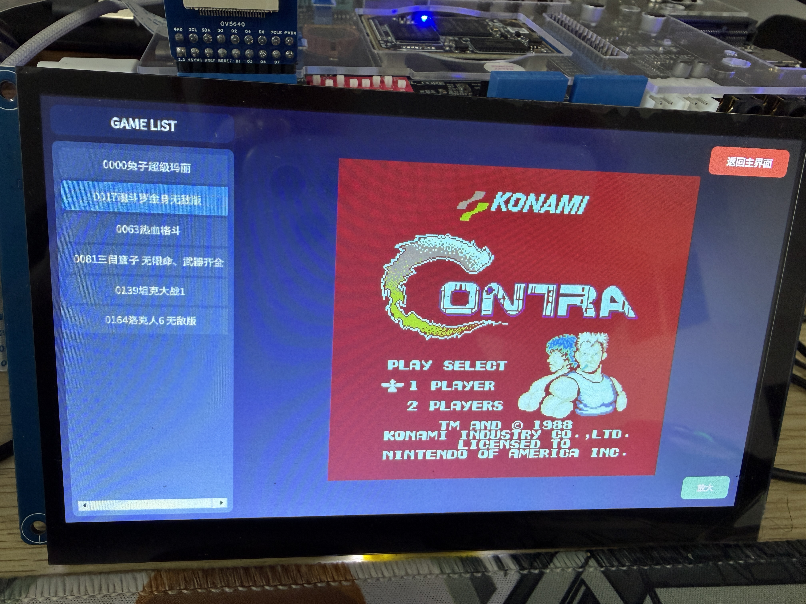

# 智能终端

基于 Qt 5 的嵌入式 Linux 智能终端综合应用，集成 MQTT 物联网控制、传感器数据采集、多媒体播放、摄像头拍照、电子书阅读等功能，适用于 ARM 嵌入式开发板（如 I.MX6ULL）。

## 功能概览
主界面


| 模块 | 功能说明 |
|------|----------|
| MQTT 控制面板 | 连接 MQTT Broker，远程控制 LED、电机，上报温度数据 

| 传感器监测 | 读取 ICM20608 六轴传感器与 AP3216C 光线/接近传感器，实时图表显示 



| 音乐播放器 | 基于 ALSA 的本地音乐播放，支持列表/单曲/随机循环模式 

| 视频播放器 | 基于 FFmpeg 的本地视频播放，支持进度拖拽、音量调节、全屏切换

| 摄像头 | V4L2 摄像头实时预览与拍照，支持多设备切换 

| 相册 | 浏览已拍摄的照片，支持前后翻页与删除 
| 电子书 | 本地 TXT 电子书阅读，支持翻页、三种阅读模式（普通/夜间/护眼） 

| NES 游戏 | 启动外部 NES 模拟器程序 


## 项目结构

```
.
├── main.cpp                  # 程序入口
├── widget.cpp/h/ui           # 主界面（QStackedWidget 页面切换）
├── mqtt_widget.cpp/h         # MQTT 控制面板
├── sensor/                   # 传感器模块
│   ├── sensor_widget.cpp/h/ui  # 传感器界面与图表
│   ├── icm20608.cpp/h          # ICM20608 六轴传感器驱动
│   └── ap3216c.cpp/h           # AP3216C 环境光/接近/红外传感器驱动
├── media/                    # 多媒体模块
│   ├── commonresource.h        # 资源路径配置
│   ├── musicwidget.cpp/h       # 音乐播放器界面
│   ├── musicplay.cpp/h         # 音乐播放引擎（ALSA）
│   ├── videowidget.cpp/h       # 视频播放器界面
│   ├── videoplay.cpp/h         # 视频播放引擎（FFmpeg）
│   ├── videoplayaudio.cpp/h    # FFmpeg 音频解码
│   ├── videoplayvideo.cpp/h    # FFmpeg 视频解码
│   └── videoqueue.cpp/h        # 视频帧队列
├── camera/                   # 摄像头与相册模块
│   ├── camera.cpp/h            # V4L2 摄像头驱动
│   ├── camera_widget.cpp/h/ui  # 摄像头界面
│   └── album_widget.cpp/h/ui   # 相册界面
├── book/                     # 电子书模块
│   └── book_widget.cpp/h/ui    # 电子书阅读界面
├── images/                   # 图片资源
├── resources.qrc             # Qt 资源文件
└── FullProject.pro           # Qt 项目配置
```

## 依赖

- **Qt 5.12+**（模块：core、gui、widgets、mqtt、charts）
- **FFmpeg**（libavformat、libavcodec、libavutil、libswresample、libswscale、libavfilter、libavdevice）
- **ALSA**（libasound）
- **Linux 设备驱动**：
  - ICM20608（`/dev/icm20608`）
  - AP3216C（`/sys/class/misc/ap3216c/`）
  - V4L2 摄像头（`/dev/video*`）
  - LED（`/sys/class/leds/sys-led/`）
  - 蜂鸣器（`/sys/devices/platform/leds/leds/beep/`）

## 编译

```bash
# 确保已安装 Qt5、FFmpeg 开发库和 ALSA 开发库
qmake FullProject.pro
make
```

交叉编译时需配置对应的 Qt ARM 工具链。

## 配置说明

开源版本中部分配置项已替换为占位符，使用前需根据你的实际环境修改：

### MQTT 连接（mqtt_widget.cpp）

```cpp
#define BROKER_ADDRESS "192.168.1.100"  // TODO: 修改为你自己的MQTT Broker IP地址
#define CLIENTID "your_client_id"      // TODO: 修改为你自己的MQTT客户端ID
#define USERNAME "your_username"       // TODO: 修改为你自己的MQTT用户名
#define PASSWORD "your_password"       // TODO: 修改为你自己的MQTT密码
```

端口号在 `m_client->setPort(1883)` 处修改。

### 资源路径（media/commonresource.h）

```cpp
#define IMAGE_SAVE_PATH "/usr/share/images"    // TODO: 修改为你自己的图片保存路径
#define MUSIC_PATH "/home/root/mymusics"       // TODO: 修改为你自己的音乐文件目录
#define VIDEO_PATH "/home/root/myvideos"       // TODO: 修改为你自己的视频文件目录
#define PCM_DEVICE "plughw:0,0"                // TODO: 修改为你自己的ALSA PCM设备
#define MIXER_DEVICE "hw:0"                    // TODO: 修改为你自己的ALSA Mixer设备
```

### 游戏路径（widget.h）

```cpp
#define NES_GAME_PATH "/home/root/Qt"  // TODO: 修改为你自己的NES游戏可执行文件路径
```

## 各模块详细说明

### MQTT 控制面板

- 连接 MQTT Broker，订阅 LED 与温度主题
- 支持电机速度调节（加速/减速/发布）
- 支持板载 LED 与 STM32 LED 远程开关控制
- 定时上报 CPU 温度（读取 `/sys/class/thermal/thermal_zone0/temp`）
- 遗嘱消息（Will Message）机制：上线时发布 `Online` 到 `dt_mqtt/will`

### 传感器监测

- **ICM20608**：读取三轴加速度（AX/AY/AZ）与三轴陀螺仪（GX/GY/GZ）数据及温度
- **AP3216C**：读取环境光（ALS）、接近距离（PS）、红外（IR）数据
- 实时折线图显示 ALS/IR/PS 三条数据曲线（QtCharts）
- 板载 LED 与蜂鸣器开关控制

### 音乐播放器

- 扫描指定目录下的音乐文件并列表显示
- 播放/暂停、上一首/下一首
- 播放进度条拖拽、音量调节
- 三种循环模式：列表循环、单曲循环、随机播放
- 独立线程播放，避免阻塞 UI

### 视频播放器

- 扫描指定目录下的视频文件并列表显示
- 基于 FFmpeg 实现音视频解码与同步播放
- 播放/暂停、上一个/下一个
- 播放进度条拖拽、音量调节
- 全屏/小屏切换
- 独立线程播放

### 摄像头

- 自动扫描 `/dev/video0`、`/dev/video1`、`/dev/video2` 设备
- 支持多摄像头切换
- 实时预览与拍照保存

### 相册

- 加载已保存的照片列表
- 前后翻页浏览
- 删除照片

### 电子书

- 扫描指定目录下的 TXT 文件并列表显示
- 自动分页显示，支持前后翻页
- 三种阅读模式：普通模式、夜间模式、护眼模式
- 自动检测文件编码

### NES 游戏

- 以外部进程方式启动 NES 模拟器
- 游戏退出后自动返回主界面
- 进程状态轮询检测，确保异常退出也能正确恢复
